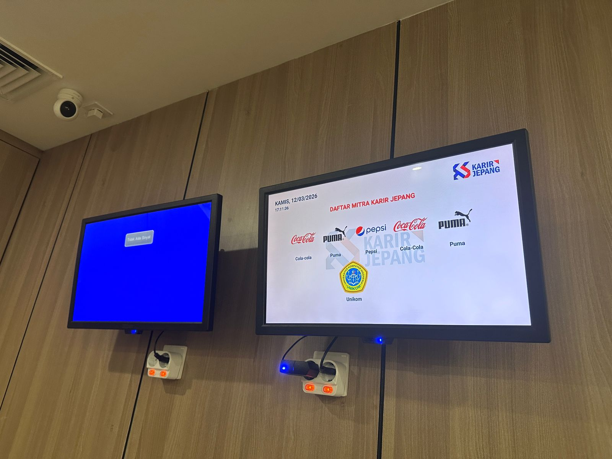

# dailymonitoringkj

## Overview
**dailymonitoringkj** is an Android TV (Leanback) application designed as an interactive monitoring dashboard.  
The application continuously displays monitoring data in landscape orientation, making it suitable for office displays or public screens as a **digital signage platform**.

## Features

### Modular Slide System
The main display is divided into multiple fragments:
- `SlideSatu`
- `SlideDua`
- `SlideTiga`
- `SlideEmpat`

Each slide has its own **ViewModel** and business logic, enabling modular development and easier maintenance.

### Dynamic Data Visualization
The application uses **MPAndroidChart** to render monitoring charts and graphs dynamically, allowing real-time data visualization.

### Centralized Data Management
All API communication is handled through a centralized **MonitoringRepository**, using **Retrofit** for network requests and response handling.

### Custom UI Components
Several custom adapters are implemented to present structured data lists:
- `KehadiranAdapter`
- `MeetingAdapter`
- `ProgressAdapter`

These adapters ensure data is displayed in a clean and readable format on large screens.

### Automated Scrolling Utilities
The application includes automation utilities such as:
- `AutoScrollManager`
- `ContinuousScrollManager`

These components enable automatic content scrolling without requiring user interaction.

## How the Application Works

### 1. Lifecycle and Auto-Start
The application is designed to run autonomously.  
Using **BootReceiver**, the system detects when the Android TV device boots and automatically launches `MainActivity` without manual interaction.

### 2. Content Transition Flow
Monitoring content is displayed through **MainActivity**, which acts as the host container for all slides.  
Slide transitions are managed with animation configurations to provide smooth and dynamic visual changes between monitoring views.

### 3. Security and Data Authentication
The application authenticates with the backend server using stored credentials.  
To enhance security:

- **security-crypto** is used to encrypt access tokens.
- **TokenAuthenticator** ensures API sessions remain valid during communication.

### 4. Time and Network Synchronization
The system includes synchronization and connectivity monitoring features:

- **ApiClock** synchronizes application time with the server to ensure accurate dashboard timestamps.
- **NetworkMonitor** continuously monitors internet connectivity to keep the displayed data up to date.

## Technical Specifications

- **Architecture:** MVVM (Model-View-ViewModel)
- **Dependency Injection:** Hilt
- **Programming Language:** Kotlin (100%)
- **Build System:** Gradle Kotlin DSL
- **Minimum SDK:** 23 (Android Marshmallow)
- **Target SDK:** 36
- **Platform:** Android TV
- **UI Framework:** Leanback Library

## Results / Application Preview

Below are example screens from the monitoring dashboard.

